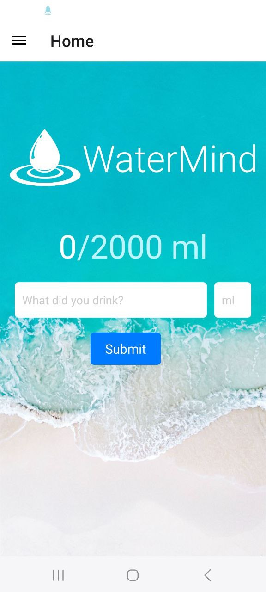
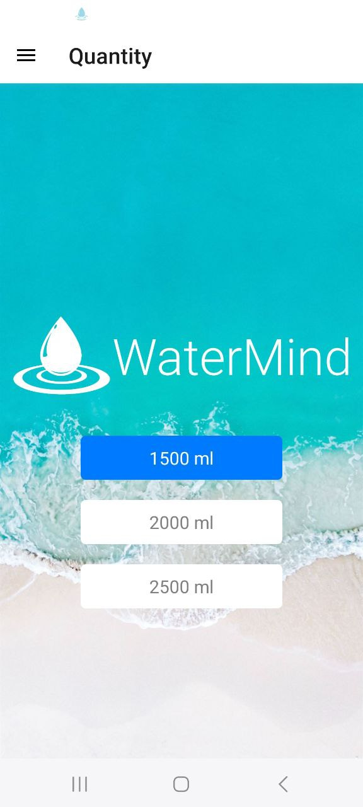
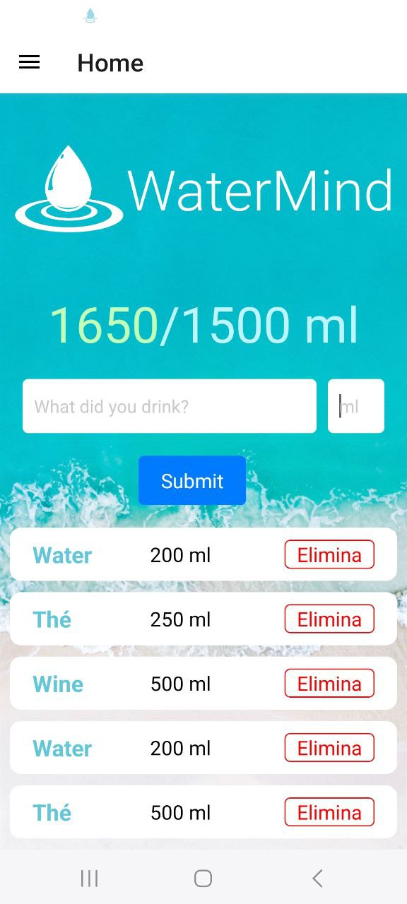

# 💧 WaterMind
WaterMind is a simple yet powerful app designed to help you stay hydrated throughout the day. It tracks your daily water intake, lets you log different beverages, and sends smart reminders to ensure you reach your hydration goals. 🚰✨

📸 Screenshots

    
    

    
    

🎯 Features  

✅ Daily Water Tracking – Log your drinks and monitor your hydration progress.  
✅ Custom Hydration Goals – Set your own daily water intake target (e.g., 1500ml, 2000ml, 2500ml).  
✅ Beverage Logging – Track different types of drinks like water, tea, coffee, and more.  
✅ Easy Drink Removal – Delete an entry with a simple tap if needed.  
✅ Achievement Alerts – Get a congratulations popup when you reach your daily goal! 🎉  
✅ Smart Hydration Reminders – The app sends a notification every hour to remind you to drink water. 🔔💦  
✅ Clean and Minimal UI – A smooth and visually appealing experience with a water-themed design.  

📲 How to Use  

1. Set Your Goal – Choose your daily water intake goal from the settings.  
2. Log Your Drinks – Enter what you drank and the amount in milliliters, then tap Submit.  
3. Track Your Progress – The app displays your current intake vs. your goal.  
4. Remove Entries – If you added a drink by mistake, just tap Elimina (Delete).  
5. Get Alerts – When you reach your goal, you'll see a congratulations popup.  
